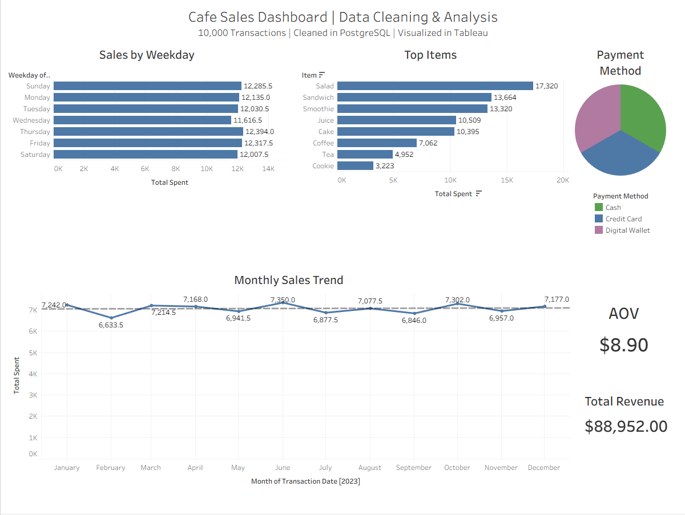

# Cafe-Sales-Cleaning-Project

## 📌 Project Overview  
This project demonstrates an **end-to-end data analytics workflow**:  

1. **Dirty Dataset (CSV)** → raw café transactions from Kaggle  
2. **Data Cleaning in PostgreSQL** → handling nulls, errors, incorrect formats  
3. **Validation & Analysis Queries** → KPIs, top items, payment mix, sales trends  
4. **Visualization in Tableau** → building a professional dashboard  

The result is a fully reproducible pipeline where anyone can start with the raw CSV and recreate the same dashboard.  

---

## 🛠️ Tech Stack  
- **PostgreSQL** (tested on v14+)  
- **DBeaver** (or psql) → database connection & query execution  
- **Tableau Public** → dashboarding  
- **GitHub** → version control + sharing  

---

## 📂 Repository Structure  

```
cafe-sales-analysis/
│
├── data/
│   └── raw/dirty_cafe_sales.csv       # Place Kaggle CSV here (not uploaded)
│
├── sql/
│   ├── 01_schemas.sql                 # create raw, prep, mart schemas
│   ├── 02_raw_table.sql               # raw table definition
│   ├── 03_clean_prep.sql              # cleaning + standardization
│   ├── 04_quality_checks.sql          # sanity checks
│   ├── 05_analysis.sql                # analysis queries (KPIs, trends)
│   ├── 06_views_mart.sql              # optional BI views
│   └── 99_reset_all.sql               # reset/drop all schemas
│
├── dashboard/
│   ├── cafe_sales.twbx                # Tableau packaged workbook
│   └── dashboard_preview.png          # screenshot
│
└── README.md
```

---

## ⬇️ Dataset  
- Kaggle: [Cafe Sales (Dirty Data for Cleaning Training)](https://www.kaggle.com/datasets/ahmedmohamed2003/cafe-sales-dirty-data-for-cleaning-training)  
- Save as: `data/raw/dirty_cafe_sales.csv`  

---

## 🚀 How to Reproduce  

### 1️⃣ Set up PostgreSQL  
- Create a new database (optional):  
```sql
CREATE DATABASE cafe_sales_db;
```
- Connect to `cafe_sales_db` in DBeaver or psql.  

---

### 2️⃣ Run SQL Pipeline  

1. **Create schemas**  
   ```sql
   \i sql/01_schemas.sql
   ```

2. **Create raw table**  
   ```sql
   \i sql/02_raw_table.sql
   ```

3. **Load CSV into raw.cafe_sales**  
   - In **DBeaver**: right-click → Import Data → choose CSV.  
   - In **psql**:  
     ```bash
     \copy raw.cafe_sales FROM 'data/raw/dirty_cafe_sales.csv' WITH (FORMAT csv, HEADER true);
     ```

   ✅ Check row count (should be 10,000):  
   ```sql
   SELECT COUNT(*) FROM raw.cafe_sales;
   ```

4. **Clean + prep data**  
   ```sql
   \i sql/03_clean_prep.sql
   ```

   This creates `prep.cafe_sales_clean` with standardized fields.

5. **Quality checks**  
   ```sql
   \i sql/04_quality_checks.sql
   ```
   - Row counts should match (10,000).  
   - Mismatched totals should be `0`.  

6. **Analysis queries**  
   ```sql
   \i sql/05_analysis.sql
   ```
   - Top items  
   - Payment method distribution  
   - Weekday sales  
   - Monthly trend  
   - KPIs (Total Revenue, Transactions, AOV)  

7. **Optional BI views**  
   ```sql
   \i sql/06_views_mart.sql
   ```

---

### 3️⃣ Connect to Tableau  

1. **Option A**: Export `prep.cafe_sales_clean` to CSV and connect Tableau → Text File.  
2. **Option B**: Connect Tableau directly to Postgres.  

**Build Sheets:**  
- Top Items (bar)  
- Payment Method (pie)  
- Sales by Weekday (bar)  
- Monthly Sales Trend (line, exclude NULLs)  
- KPIs:  
  - Total Revenue = `SUM([Total Spent])`  
  - Transactions = `COUNTD([Transaction ID])`  
  - AOV = `SUM([Total Spent]) / COUNTD([Transaction ID])`  

**Assemble Dashboard:**  
- Title + subtitle  
- KPI cards  
- Charts arranged top/middle  
- Export PNG preview  

---

## ✅ Expected Outputs  

- **Row Counts:**  
  - Raw: 10,000  
  - Clean: 10,000  

- **KPIs:**  
  - Total Revenue ≈ **$88,952**  
  - Transactions = **10,000**  
  - AOV ≈ **$8.90**  

- **Insights:**  
  - **Top Items:** Salads, Sandwiches, Smoothies  
  - **Payment Mix:** Balanced across Cash, Credit, Digital Wallet  
  - **Sales by Weekday:** Fairly even, slight dip midweek  
  - **Monthly Sales Trend:** Stable revenue across months  

---

## 📊 Dashboard  

**Interactive Version (Tableau Public):** [🔗 Add your Tableau Public link here]  

**Preview Screenshot:**  
  

---

## 🔁 Reset & Re-run  
To drop everything and start fresh:  
```sql
\i sql/99_reset_all.sql
```

---

## 📣 Summary  
This project shows a **complete analyst workflow**:  

- SQL for cleaning & data quality checks  
- Analysis queries for business insights  
- Tableau for professional dashboarding  
